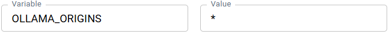

# WEB CHAT với AI tạo bởi Ollama

 ứng dụng trò chuyện nền web đơn giản, sử dụng HTML/JavaScript để tương tác trực tiếp với Ollama Server, bao gồm cả tính năng truyền tải dữ liệu theo luồng (streaming).

## Mục Tiêu và Chức Năng

Đặc điểm | Mô tả
-- | --
Mục tiêu | Cung cấp giao diện đồ họa (GUI) đơn giản để trò chuyện với các mô hình LLM trên Ollama mà không cần sử dụng giao diện dòng lệnh (CLI).
Chức năng chính | Streaming: Nhận và hiển thị phản hồi từ mô hình theo thời gian thực (từng ký tự, từng đoạn văn bản) để giảm độ trễ cảm nhận.
Tính năng bổ sung | Hỗ trợ hủy yêu cầu đang chạy bằng cách nhấn tổ hợp phím Ctrl+C (tương đương với KeyboardInterrupt trong CLI).

## Nguyên Lý Vận Hành (Client-side Streaming)

- Gửi Request: Khi người dùng nhấn Gửi, JavaScript sử dụng API fetch với phương thức POST tới endpoint /api/generate của Ollama.
- Kích hoạt Streaming: Payload JSON được gửi PHẢI bao gồm tham số "stream": true.
- Xử lý Luồng: Thay vì chờ toàn bộ phản hồi, mã JavaScript sử dụng response.body.getReader() để đọc luồng dữ liệu theo từng gói (chunk) bytes.
- Hiển thị: Dữ liệu nhận được là các đối tượng JSON, được phân tích và trích xuất trường "response" rồi thêm ngay lập tức vào phần tử HTML (responseTextElement.textContent), tạo ra hiệu ứng phản hồi tức thì.
- Hủy yêu cầu: AbortController được sử dụng để hủy kết nối fetch nếu người dùng nhấn Ctrl+C, giúp giải phóng tài nguyên.

## Yêu cầu môi trường

- Điều chỉnh lại tên của __model__ được cài đặt ở __ollama__ trong file [webchat.html](./webchat.html). Mặc định là __deepseek-r1:1.5b__.
- __[Ollama](https://ollama.com/)__ cài đặt trước với model __deepseek-r1:1.5b__
- Cấu hình Ollama để Tránh Lỗi CORS (Rất quan trọng): Do ứng dụng web này được chạy từ một nguồn gốc (origin) khác với Ollama Server (thường là <http://localhost:11434>), trình duyệt sẽ chặn yêu cầu nếu Ollama không cho phép. Lỗi phổ biến nhất là 405 Method Not Allowed hoặc lỗi liên quan đến CORS Preflight (OPTIONS).
Để khắc phục, phải cấu hình biến môi trường OLLAMA_ORIGINS khi khởi động Ollama Server:
  - Nếu chạy ollama trực tiếp từ dòng lệnh thì

    ```shell
      export OLLAMA_ORIGINS="*"
      ollama serve
    ```

  - Nếu chạy ollama từ __docker compose__ thì

    ```yml
    services:
      ollama:
        # ...
        environment:
          # Thay '*' bằng tên miền cụ thể nếu cần bảo mật hơn
          - OLLAMA_ORIGINS=*
        # ...    
    ```

  - Nếu chạy ollama từ __Docker Desktop__ thì\
      
